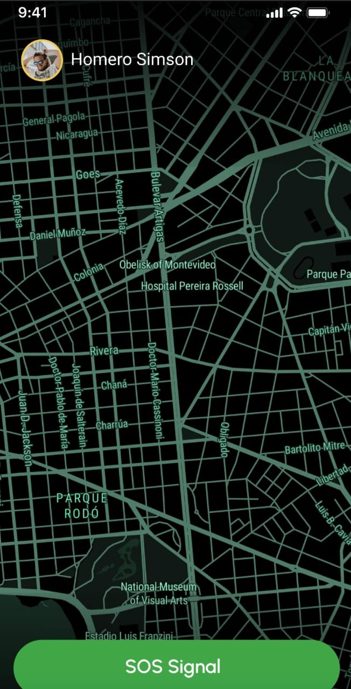

# Chaos Cause - Disaster Management System 

Natural catastrophes occur when a danger overwhelms a particularly susceptible community, resulting in significant death and morbidity. Over 300 natural catastrophes have struck the world each year in the last decade, hurting millions and costing billions of dollars. The disaster cycle is a framework for developing a coordinated response,
recovery, prevention, and preparedness strategy in the case of a disaster. Hence a tourism disaster management system is essential.

The Tourism Disaster Management System is an interactive Python-based desktop application that helps users record, visualize, and analyze disaster-related incidents and conditions. It integrates various tools and libraries for data collection, visualization, and weather condition analysis. This system is designed to facilitate disaster response and management by providing detailed data entry forms, regression analysis for hazard prediction, and map-based visualizations of affected areas.

It has the following modules: 

1. Home Page:
2. Map
3. SOS Button
4. User Profile
5. Emergency Contact
6. Feed

### Technologies Used
**Languages:** Dart
**UI/UX:** Flutter framework
**Backend Services:** Firebase for user data and authentication
**Authentication:** Google Authentication for user login and data security

## Project Screenshots

Here are some screenshots showcasing the application in action:

    
    
    

    
    
    

