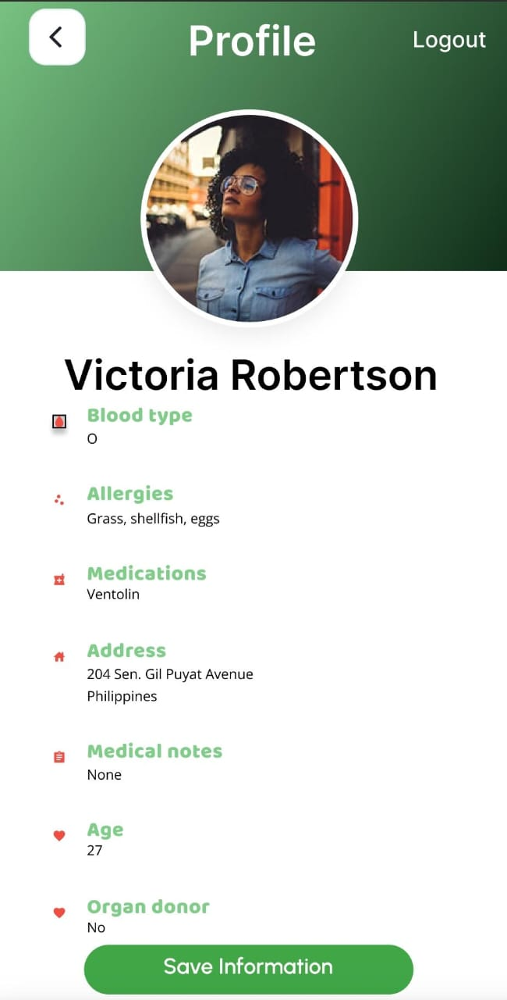

# Chaos Cause - Disaster Management System 

## History and Problem Statement 

The Murree tragedy -of 2021- could have easily been avoided with proper measures. Heavy rains have lashed Islamabad and Rawalpindi, while Murree and nearby hill stations in the Gaaliyat area have received intermittent but heavy snowfall. Notwithstanding this, a record number of people traveled northbound to experience the snowfall. News reports quoting traffic authorities revealed that more than 155,000 vehicles entered Murree in the past week, out of which 135,000 returned safely, but the rest became stranded. The large inflow of tourists made it difficult to reach help with time. In DMS, we have developed modules that could have helped the authorities locate people better to help them on time. 

Link: https://www.pakistantoday.com.pk/2022/01/24/the-murree-tragedy-exploring-the-reasons-of-a-deadly-situation/

Natural catastrophes occur when a danger overwhelms a particularly susceptible community, resulting in significant death and morbidity. Over 300 natural catastrophes have struck the world each year in the last decade, hurting millions and costing billions of dollars. The disaster cycle is a framework for developing a coordinated response,
recovery, prevention, and preparedness strategy in the case of a disaster. Hence a tourism disaster management system is essential.

This project tackles the following UN-SDGs: 

    
    

The Tourism Disaster Management System is an interactive Python-based desktop application that helps users record, visualize, and analyze disaster-related incidents and conditions. It integrates various tools and libraries for data collection, visualization, and weather condition analysis. This system is designed to facilitate disaster response and management by providing detailed data entry forms, regression analysis for hazard prediction, and map-based visualizations of affected areas.

It has the following modules: 

1. Home Page:
2. Map
3. SOS Button
4. User Profile
5. Emergency Contact
6. Feed

### Technologies Used
**Languages:** Dart

**UI/UX:** Flutter framework ( Tkinter previously)

**Backend Services:** Firebase for user data and authentication

**Authentication:** Google Authentication for user login and data security

Figma File: https://www.figma.com/design/0z77cC0YxeboKAeQ2tjl67/CHAOS-CAUSE?node-id=0-1&node-type=canvas 

## Project Screenshots

Here are some screenshots showcasing the application in action:

    
    
    

    
    
    

